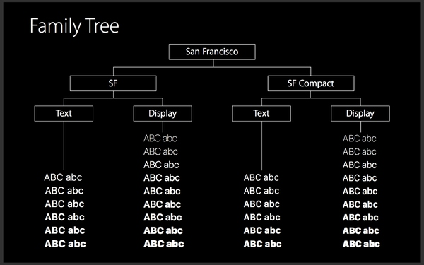
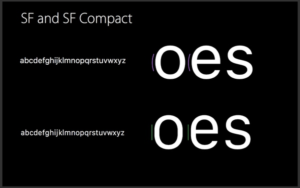
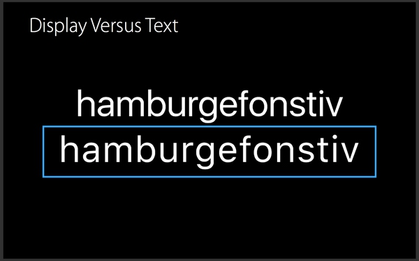
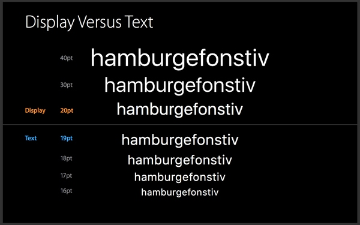
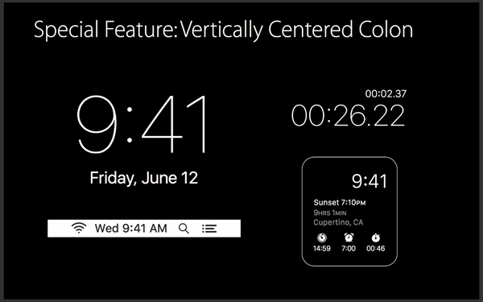

[介绍](http://www.uisdc.com/ios-9-font-transition)

## 中文苹果字体
iOS9 以前都是**黑体**

Google 联合 Adobe 发布 **思源黑体**  作为Android默认中文字体

iOS 9 **苹方** 6个自重

## 英文 San Francisco

iOS & OS X  === > SF
Watch OS  === > SF Compact

SF Compact这个字体目前专门为 Watch OS 设计，该字体最明显的差异就是字碗（Bowl）的设计，Compact的更加平直，显的瘦长，手表的界面非常小，通过增加字体间间距可以提高字体的阅读性。

这个比较特别的是 SF 字体包含了两个，分别为：SF-UI-Display 和 SF-UI-Text ，他们的差异主要是字体间距的不同，Text 的字体间距较大，再小的字体中更加易读。

而苹果建议使用规则是：小于 19pt 使用 Text,大于19pt 使用 Display,当你在 APP里面使用了 SF 字体后系统会自动选择使用SF-UI-Display 还是 SF-UI-Text。

SF字体的另外一个特性是支持符号的整体居中，比如时间显示，之前的 Helvetica 的冒号是不居中的，但是新的字体调用其 API 可以实现居中。

