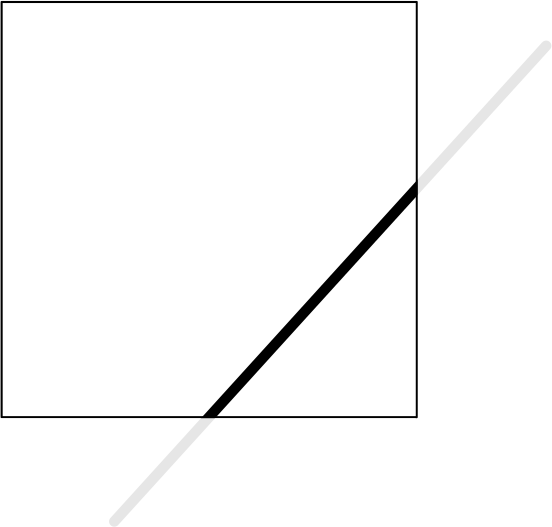
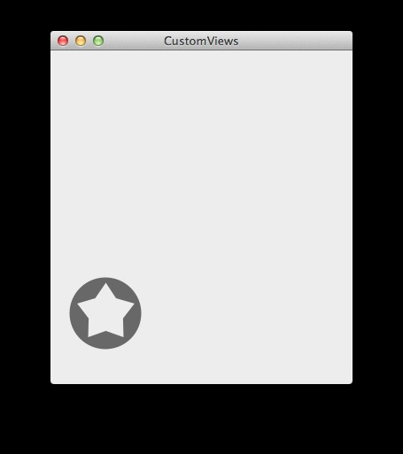

# Learning Cocoa with Objective-C

2014,4th Edition

[Github Repo](https://github.com/thesecretlab/LearningCocoa4thEd)

## Chapter 1. Cocoa Development Tools

## Chapter 2. Object-Oriented Programming with Objective-C
```
typedef struct objc_class *Class;
typedef struct objc_object *id;

struct objc_object {
    Class isa  OBJC_ISA_AVAILABILITY;
};
struct objc_class {
    Class isa  OBJC_ISA_AVAILABILITY;
}
```

## Chapter 3. Foundation

If you attempt to decode a value for a key that was not encoded in encodeWithCoder:, the decoder will throw an exception and your app will crash.

## Chapter 4. Applications on OS X and iOS

“Cocoa” is the term used by Apple to refer to the collection of libraries used by applications on OS X. On iOS, the equivalent term is “Cocoa Touch,” as it’s adapted for touch-screen devices.


### Application Lifecycle

When the app is launched, the Info.plist file is checked, the compiled binary is found and loaded, and the application begins running code, starting by unpacking the contents of the main nib.

When the application completes loading, the application delegate receives the applicationDidFinishLaunching:withOptions: method. 
(dictionary contains information about why and how the application was launched)

**note**
If you are able, try to reduce the amount of memory being used to under 16 MB. When the application is suspended and the memory usage is under 16 MB, the system will store the application’s memory on the flash chips and remove it from memory entirely. When the application is resumed, the application’s memory state is reloaded from the stored memory on the flash chips—meaning that the application won’t be evicted from memory due to another application’s memory demands. We’ll look at how to measure memory usage in

### background fetching
An application can request to run in the background for a short period of time. This background period can be no longer than 10 minutes, and it exists to allow your application to complete a long-running process—writing large files to disk, completing a download, or some other lengthy process. At the end of the 10 minutes, your application must indicate to the OS that it is done or it will be terminated (not suspended, but terminated—gone from memory completely).

```
- (void)applicationDidEnterBackground:(UIApplication *)application
{
    backgroundTask = [application beginBackgroundTaskWithExpirationHandler:^{
        // Stop performing the task in the background (stop calculations, etc)
        // This expiration handler block is optional, but recommended!

        // Then, tell the system that the task is complete.
        [application endBackgroundTask:backgroundTask];
        backgroundTask = UIBackgroundTaskInvalid;
    }];

    // Start running a block in the background to do the work.
    dispatch_async(dispatch_get_global_queue(DISPATCH_QUEUE_PRIORITY_DEFAULT, 0), 
                   ^{
        // Start doing the background work: write, calculate, etc.

        // Once the work is done, tell the system
        // that the task is complete.
        [application endBackgroundTask:backgroundTask];
        backgroundTask = UIBackgroundTaskInvalid;
    });
}
```
In iOS 7, there is no guarantee that the extra time to perform background tasks will be in one contiguous chunk; the time may be broken up into multiple chunks to improve battery life. Also exclusive to iOS 7 are two new means of running tasks in the background: background fetching and background notifications.

```
- (void)application:(UIApplication *)application 
performFetchWithCompletionHandler:
(void (^)(UIBackgroundFetchResult))completionHandler
{
    // check for new data to fetch
    // then tell the system you are finished
    // what you tell the system changes if you found new data or not
    
    // newData is a BOOL representing here if there was new data fetched or not
    if (newData)
        completionHandler(UIBackgroundFetchResultNewData);
    else
        completionHandler(UIBackgroundFetchResultNoData);
}
```

**warning**
Keep in mind that despite letting you set a minimum interval for fetching in the background, iOS will wake your application when it determines is the best time without causing unnecessary drain on the device’s battery. In a similar manner, Apple will limit how many remote notifications are sent to the device for the same reasons. If your application isn’t behaving exactly as you set it, this might be the cause.

### Sandbox

Sandboxes are somewhat optional for Mac applications, and mandatory for iOS applications.

### Private APIs

## Chapter 5. Graphical User Interfaces

### How nib files are loaded

When a nib file is loaded, usually as part of application startup, every object it contains is re-created based on information stored in the nib: its class, position, label, size, and all its other relevant properties.

Once all objects exist in memory, every outlet defined in the nib file is connected. A nib file effectively describes a source object, a destination object, and the name of a property on the destination object. To connect the objects together, then, the nib file loading process sets the value of the destination object’s property to the source object.

After all outlets are connected, every single object that was loaded receives the awakeFromNib: message. By the time this method is called, every outlet has been connected, and all relationships between the objects have been reestablished.

## Chapter 6. Blocks and Operation Queues

When you create a block, it is stored on the stack. However, if you were to create a block, store it in an instance variable, and then return from the current method, the block (which exists only on the stack) is removed from memory but the instance variable still points to where it was. If you were to then call the block variable, your program would crash—the block no longer exists.

To solve this problem, you must copy the block to the heap if you wish to keep it around for longer than until the function returns. To do this, send the block the copy message, in the same way you would send a message to any other Objective-C object. Once a block has been copied to the heap, it can be safely stored anywhere. Of course, it must later be deallocated to avoid a memory leak, but both the garbage collector and Automatic Reference Counting will handle this for you.


#### NSOperationQueue

Queues aren’t the same as threads, and creating a new queue doesn’t guarantee that you’ll create a new thread—the operating system will reuse an existing thread if it can, since creating threads is expensive. The only thing using multiple queues guarantees is that the operations running on them won’t block each other from running at the same time.


#### we’ll make the application run some code in the background when the application quits.

```
- (void)applicationDidEnterBackground:(UIApplication *)application
{
    // Register a background task. This keeps the app from being
    // terminated until we tell the system that the task is complete.

    UIBackgroundTaskIdentifier backgroundTask =
        [application beginBackgroundTaskWithExpirationHandler:nil];

    // Make a new background queue to run our background code on.
    NSOperationQueue* backgroundQueue = [[NSOperationQueue alloc] init];

    [backgroundQueue addOperationWithBlock:^{
        // Send a notification to the server.

        // Prepare the URL
        NSURL* notificationURL = [NSURL
            URLWithString:@"http://www.oreilly.com/"];

        // Prepare the URL request
        NSURLRequest* notificationURLRequest = [NSURLRequest
            requestWithURL:notificationURL];

        // Send the request, and log the reply
        NSData* loadedData = [NSURLConnection
            sendSynchronousRequest:notificationURLRequest
                 returningResponse:nil
                             error:nil];

        // Convert the data to a string
        NSString* loadedString = [[NSString alloc] initWithData:loadedData
                                        encoding:NSUTF8StringEncoding];

        NSLog(@"Loaded: %@", loadedString);

        // Tell the system that the background task is done
        [application endBackgroundTask:backgroundTask];
    }];
}
```

## Chapter 7. Drawing Graphics in Views

When you create a graphics context, you indicate what size that context should be. So, for example, if you create a context that is 300 pixels wide by 400 pixels high, the canvas is set to that size. Any drawing that takes place outside the canvas is ignored, and doesn’t appear on the canvas (Figure 7-4).



Using subpaths is also a great way to create complex shapes. In this next example, we’ll create a circle that contains a star-shaped hole in it. We’ll do this by first creating a circular path, and then adding a star-shaped subpath. Replace the drawRect: method with the following code:

```
- (void)drawRect:(NSRect)dirtyRect
{
    //// Bezier Drawing
    NSBezierPath* bezierPath = [NSBezierPath bezierPath];

    // Draw the star.

    [bezierPath moveToPoint: NSMakePoint(42.5, 77.5)];
    [bezierPath lineToPoint: NSMakePoint(30.51, 60)];
    [bezierPath lineToPoint: NSMakePoint(10.16, 54.01)];
    [bezierPath lineToPoint: NSMakePoint(23.1, 37.2)];
    [bezierPath lineToPoint: NSMakePoint(22.52, 15.99)];
    [bezierPath lineToPoint: NSMakePoint(42.5, 23.1)];
    [bezierPath lineToPoint: NSMakePoint(62.48, 15.99)];
    [bezierPath lineToPoint: NSMakePoint(61.9, 37.2)];
    [bezierPath lineToPoint: NSMakePoint(74.84, 54.01)];
    [bezierPath lineToPoint: NSMakePoint(54, 60)];
    [bezierPath lineToPoint: NSMakePoint(42.5, 77.5)];
    [bezierPath closePath];

    // Draw the circle outside it.

    [bezierPath moveToPoint: NSMakePoint(70.64, 71.64)];

    [bezierPath curveToPoint: NSMakePoint(70.64, 14.36)
        controlPoint1: NSMakePoint(86.45, 55.82)
        controlPoint2: NSMakePoint(86.45, 30.18)];

    [bezierPath curveToPoint: NSMakePoint(13.36, 14.36)
        controlPoint1: NSMakePoint(54.82, -1.45)
        controlPoint2: NSMakePoint(29.18, -1.45)];

    [bezierPath curveToPoint: NSMakePoint(13.36, 71.64)
        controlPoint1: NSMakePoint(-2.45, 30.18)
        controlPoint2: NSMakePoint(-2.45, 55.82)];

    [bezierPath curveToPoint: NSMakePoint(70.64, 71.64)
        controlPoint1: NSMakePoint(29.18, 87.45)
        controlPoint2: NSMakePoint(54.82, 87.45)];

    [bezierPath closePath];

    // Fill the path.
    [[NSColor darkGrayColor] setFill];
    [bezierPath fill];
}
```



### Draw gradient

```
- (void) drawRect:(CGRect)dirtyRect {
    CGColorSpaceRef colorSpace = CGColorSpaceCreateDeviceRGB();
    CGContextRef context = UIGraphicsGetCurrentContext();

    //// Color Declarations
    UIColor* gradientStartColor = [UIColor colorWithRed: 0.0
                                                  green: 0.2
                                                    blue: 0.7
                                                   alpha: 1];

    UIColor* gradientEndColor = [UIColor colorWithRed: 0.3
                                                green: 0.4
                                                 blue: 0.8
                                                alpha: 1];

    // Gradient Declarations
    NSArray* gradientColors = [NSArray arrayWithObjects:
        (id)gradientStartColor.CGColor,
        (id)gradientEndColor.CGColor, nil];
    CGFloat gradientLocations[] = {0, 1};
    CGGradientRef gradient = CGGradientCreateWithColors(colorSpace,
        (CFArrayRef)gradientColors, gradientLocations);


    // Rounded Rectangle Drawing

    CGRect pathRect = CGRectInset(self.bounds, 20, 20);

    CGPoint topPoint = CGPointMake(self.bounds.size.width / 2, 20);
    CGPoint bottomPoint = CGPointMake(self.bounds.size.width / 2,
        self.bounds.size.height - 20);

    UIBezierPath* roundedRectanglePath = [UIBezierPath
        bezierPathWithRoundedRect: pathRect cornerRadius: 4];
    CGContextSaveGState(context);
    [roundedRectanglePath addClip];
    CGContextDrawLinearGradient(context, gradient, bottomPoint, topPoint, 0);
    CGContextRestoreGState(context);

    // Cleanup
    CGGradientRelease(gradient);
    CGColorSpaceRelease(colorSpace);
}
```

## Chapter 8. Audio and Video

### Speech Synthesis osx

```
// creating a speech synthesizer
AVSpeechSynthesizer *speech = [[AVSpeechSynthesizer alloc] init];
// creating an utterance to synthesize
AVSpeechUtterance *utterance = [AVSpeechUtterance 
    speechUtteranceWithString:@"I am the very model of a modern Major General!"];
// setting a rate for the utterance to run at
[utterance setRate:0.175];
// telling the synthesizer to synthesize and play the utterance.
[_speech speakUtterance:utterance];
```

## Chapter 9. Model Objects and Data Storage

## Chapter 10. Cocoa Bindings


### Binding Views to Models

## Chapter 11. Table Views and Collection Views

## Chapter 12. Document-Based Applications

## Chapter 13. Networking

```
- (void)applicationDidFinishLaunching:(NSNotification *)aNotification
{

    // PlaceKitten.com URLs work like this:
    // http://placekitten.com/<width>/<height>

    int width = (int)self.imageView.bounds.size.width;
    int height = (int)self.imageView.bounds.size.height;

    NSString* urlString = [NSString
        stringWithFormat:@"http://placekitten.com/%i/%i", width, height];

    NSURL* url = [NSURL URLWithString:urlString];

    NSURLSession *session = [NSURLSession sessionWithConfiguration:
    [NSURLSessionConfiguration defaultSessionConfiguration]];
    [[session dataTaskWithURL:url 
    completionHandler:^(NSData *data, NSURLResponse *response, 
    NSError *error) {
        NSImage *image = [[NSImage alloc] initWithData:data];
        self.imageView.image = image;
    }] resume];

}
```

It is very important to call resume on any NSURLSessions after giving them a task. As NSURLSession is designed to handle enqueing of multiple tasks, it needs to be told to start.

### Bonjour Service Discovery

Bonjour is a protocol based on multicast DNS that allows a network service to advertise its presence on a network, and provides a method for clients to find services. Bonjour doesn’t handle the actual connection, just the discovery.

## Chapter 14. Working with the Real World

### LOCATION HARDWARE

There are a number of different techniques for determining where a computer is on the planet, and each requires different hardware. The ones in use by iOS and OS X are:

- GPS, the Global Positioning System

- WiFi base station lookups

- Cell tower lookups

- iBeacons

#### GPS

GPS devices became popular first as navigation assistants for cars, and later as features built into smartphones. Initially developed by the US military, the GPS is a constellation of satellites that contain extremely precise clocks and continuously broadcast time information. A GPS receiver is able to listen for these time signals and compare them to determine where the user is.

Depending on how many satellites the GPS receiver can see, GPS is capable of working out a location to less than one meter of accuracy.

The GPS receiver is only included on the iPhone, and on iPad models that contain 3G or 4G cellular radios. It’s not included on any desktop, laptop, or iPod touch, or on WiFi-only iPads.

Since the introduction of the iPhone 4S and later models, iOS devices capable of receiving GPS signals are also capable of receiving signals from GLONASS, the Globalnaya navigatsionnaya sputnikovaya sistema, a Russian satellite navigation system, all transparently handled and combined with GPS to give you a better location.

#### WiFi

While a device that uses WiFi to access the Internet may move around a lot, the base stations that provide that connection generally don’t move around at all. This fact can be used to determine the location of a user if a GPS receiver isn’t available.

Apple maintains a gigantic database of WiFi hotspots, along with rough coordinates that indicate where those hotspots are. If a device can see WiFi hotspots and is also connected to the Internet, it can tell Apple’s servers, “I can see hotspots A, B, and C.” Apple’s servers can then reply, “If you can see them, then you must be near them, and therefore you must be near location X.” The device keeps a subset of this database locally, in case a WiFi lookup is necessary when the device has no access to the Internet.

Usually, this method of locating the user isn’t terribly precise, but it is able to get within 100 meters of accuracy. Because it uses hardware that’s built into all devices that can run OS X and iOS, this capability is available on every device.

#### Cell tower

If a device uses cell towers to communicate with the Internet, it can perform a similar trick with the towers as with WiFi base stations. The exact same technique is used, although the results are slightly less accurate—because cell towers are less numerous than WiFi stations, cell tower lookups can only get within a kilometer or so of accuracy.

Cell tower lookups are available on any device that includes a cell radio, meaning the iPhone and the 3G and 4G models of iPad.

#### iBeacons

iBeacons are a new means of determining location using low energy Bluetooth devices. By constantly broadcasting their existence via a unique identifier, they can be detected by an iOS 7 device, allowing you to determine where you are based on the iBeacon’s location. iBeacon location and accuracy is much more subjective than any of the other location methods: instead of telling you your position on the planet, iBeacons can tell you when you are near or far from them. iBeacons are designed more to determine the store you’re near in a shopping mall or the artwork you’re close to in a museum, rather than to work out where you are for navigation or tracking.

iBeacons are available on any device capable of running iOS 7. Additionally, these devices can also be set up to act as an iBeacon themselves.

#### App Nap

App Nap is a new feature in OS X 10.9 designed to improve battery life without impinging upon an app’s responsiveness. It accomplishes this through a bunch of different heuristics to determine what apps should be suspended. The heuristics used to determine if your app may be suspended by the OS are as follows:

- The app is not visible.

- The app is not making any noise.

- The app has not disabled automatic termination.

- The app has not made any power management assertions.

When asleep, your app is put in a scheduling queue that rarely gets any processing time. Any user activity that brings your app to the foreground or the receipt of an OS event will awaken your app and return it to normal processing priority. App Nap is essentially trying to keep your computer’s CPU idling for a long as possible, only leaving the idle state when necessary before returning to idle state as quickly as possible.

## Chapter 15. Event Kit

## Chapter 16. Instruments and the Debugger

## Chapter 17. Sharing and Notifications

### SHARING ON IOS

```
NSString* text = @"Hello, world!";
UIActivityViewController* activity = [[UIActivityViewController alloc]
    initWithActivityItems:@[text] applicationActivities:nil];

[self presentViewController:activity animated:YES completion:nil];
```

### SHARING ON OS X

```
NSString* text = @"Hello, world!"
NSSharingServicePicker* picker = [[NSSharingServicePicker alloc]
    initWithItems:@[text]];
[picker showRelativeToRect:myView.bounds
    ofView:myView
    preferredEdge:NSMaxXEdge];

```

### Push Notification
```
{
    "aps":{
        "alert":"Hello, world!",
        "badge":1,
        "sound":"hello.wav"
    },
    "foo":"bar"
}
```

## Chapter 18. Nonstandard Apps

#### Another Screen (Window)

```
- (BOOL)application:(UIApplication *)application didFinishLaunchingWithOptions:(NSDictionary *)launchOptions
{
	NSNotificationCenter *centre = [NSNotificationCenter defaultCenter];
	[centre addObserver:self selector:@selector(screenDidConnect:) name:UIScreenDidConnectNotification object:nil];
	[centre addObserver:self selector:@selector(screenDidDisconnect:) name:UIScreenDidDisconnectNotification object:nil];

    return YES;
}
- (void)screenDidConnect:(NSNotification *)notification
{
	UIScreen *screen = [notification object];
	if (!self.secondWindow)
	{
		self.secondWindow = [[UIWindow alloc] initWithFrame:screen.bounds];
		self.secondWindow.screen = screen;
		UIStoryboard *storyboard = [UIStoryboard storyboardWithName:@"Main" bundle:nil];
		UIViewController *secondVC = [storyboard instantiateViewControllerWithIdentifier:@"secondWindowVC"];
		self.secondWindow.rootViewController = secondVC;
        [self.secondWindow makeKeyAndVisible];
        [self.window setNeedsLayout];

	}
}
- (void)screenDidDisconnect:(NSNotification *)notifcation
{
	if (self.secondWindow)
	{
		self.secondWindow.hidden = YES;
		self.secondWindow = nil;
	}
}

```

## Chapter 19. Working with Text


#### Formatting Data with NSFormatter

NSDateFormatterNoStyle

NSDateFormatterShortStyle

- Dates appear like “10/24/86” and times appear like “5:05pm.”

NSDateFormatterMediumStyle

- Dates appear like “Oct 24, 1986.” Times appear like the short style.

NSDateFormatterLongStyle

- Dates appear like “October 24, 1986” and times appear like “5:05:23pm.”

NSDateFormatterFullStyle

- Dates appear like “Friday, October 24, 1986 AD” and times appear like “5:05:23pm AEDT.”

```
NSDateFormatter* dateFormatter = [[NSDateFormatter alloc] init];
[dateFormatter setDateFormat:@"HH:mm, MMMM d"];

NSString* dateString = [dateFormatter stringFromDate:[NSDate date]];
```

#### Detecting Data with NSDataDetector

```
NSError *error = nil;
NSDataDetector *detector = [NSDataDetector
    dataDetectorWithTypes:NSTextCheckingTypeLink error:error];

NSString* string = @"Here is a link: http://oreilly.com!"
NSInteger numberOfMatches = [detector numberOfMatchesInString:string
    options:0
    range:NSMakeRange(0, [string length])];

// numberOfMatches is 1

NSArray *matches = [detector matchesInString:string
    options:0
    range:NSMakeRange(0, [string length])];
```

```
- (IBAction)check:(id)sender {
    NSDataDetector* detector = [NSDataDetector
        dataDetectorWithTypes:NSTextCheckingAllTypes error:nil];

    NSString* inputString = self.inputTextField.stringValue;
    NSMutableString* resultsText = [NSMutableString string];

    NSArray* matches = [detector matchesInString:inputString
        options:0
        range:NSMakeRange(0, inputString.length)];

    for (NSTextCheckingResult* match in matches) {
        switch (match.resultType) {
            case NSTextCheckingTypeLink:
                [resultsText appendFormat:@"Found a link: %@\n", match.URL];
                break;
            case NSTextCheckingTypeDate:
                [resultsText appendFormat:@"Found a date: %@\n", match.date];
                break;
            case NSTextCheckingTypePhoneNumber:
                [resultsText appendFormat:@"Found a phone number: %@\n",
                    match.phoneNumber];
                break;
            case NSTextCheckingTypeAddress:
                [resultsText appendFormat:@"Found an address: %@\n",
                    match.addressComponents];
                break;
            default:
                break;
        }
    }

    self.outputTextField.stringValue = resultsText;
}
```

## Chapter 20. iCloud

```
    [[NSNotificationCenter defaultCenter] addObserver:self
        selector:@selector(keyValueStoreDidChange:)
        name:NSUbiquitousKeyValueStoreDidChangeExternallyNotification
        object:[NSUbiquitousKeyValueStore defaultStore]];

    self.textField.text = [[NSUbiquitousKeyValueStore defaultStore]
        stringForKey:@"cloud_string"];

    [[NSUbiquitousKeyValueStore defaultStore] setString:self.textField.text
        forKey:@"cloud_string"];
```

Be patient—it might take a few seconds before the change appears on the other device.


#### iCloud Storage

Storing keys and values in iCloud is extremely useful for persisting user preferences across all their devices, but if you want to make the user’s files just as ubiquitous, you need to use iCloud storage.

In order to be a good citizen in iCloud, there are a number of things that your application should do in order to provide the best user experience:

- Don’t store some documents in iCloud and some outside. It’s easier for users to choose to store all their data in iCloud or to not store anything there.

- Only store user-created content in iCloud. Don’t store caches, settings, or anything else—iCloud is meant for storing things that cannot be re-created by the app.

- If you delete an item from iCloud, the file is removed from all the user’s devices and computers. This means that you should confirm a delete operation with the user before performing it, as users might not understand the implications and may think that they’re only deleting the local copy of the file.