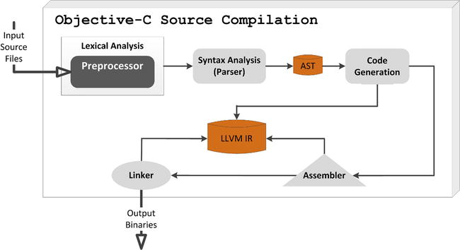
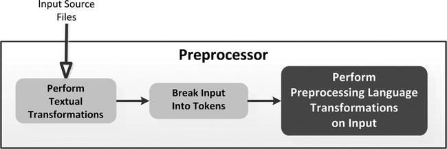
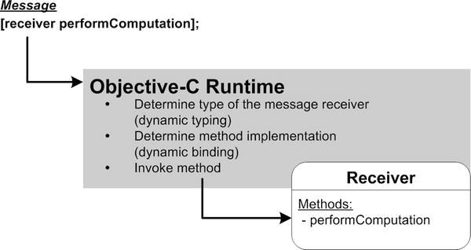
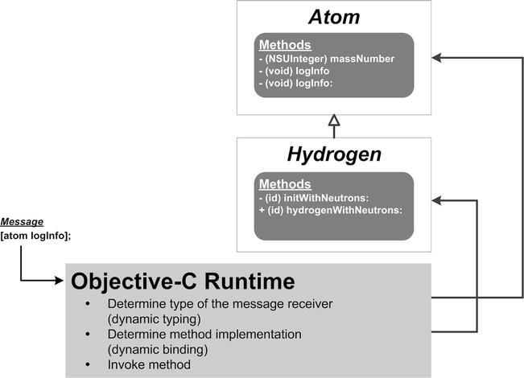
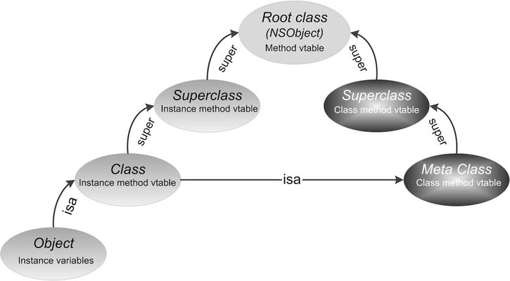
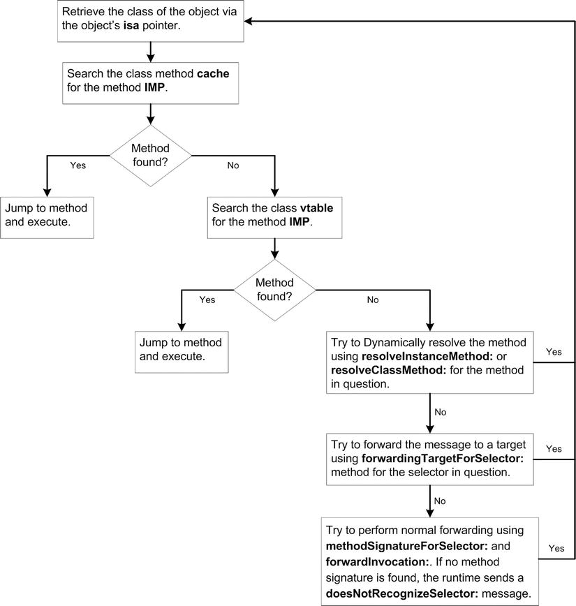
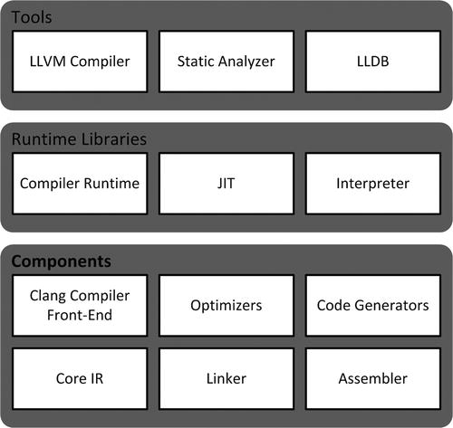

 Safari Online books

### Pro Objective-C




- During the lexical analysis phase, the source code is broken down into tokens. Each token is a single element of the language; for example, a keyword, operator, identifier, or symbol name within the context of its grammar.

- The syntax analysis (or parsing) phase checks the tokens for the correct syntax and verifies that they form a valid expression. This task concludes with the creation of a hierarchical parse tree or an abstract syntax tree (AST) from the tokens.

- During code generation and optimization, the AST is used to generate code in the output language, which may be a machine language or an intermediate language representation (IR). The code is also optimized into a functionally equivalent but faster and smaller form.

- The assembly phase takes the generated code and converts it into executable machine code for the target platform. 

- Finally, during the linking phase, one or more machine code outputs from the assembler are combined into a single executable program.


### Preprocessor



1. Textual translation: First, the preprocessor translates the input source file by breaking it into lines, replacing trigraphs by their corresponding single characters, merging continued lines into one long line, and replacing comments with single spaces. A trigraph is a three-character sequence defined by the C programming language to stand for single characters.

2. Token conversion: Next, the preprocessor converts the translated file into a sequence of tokens.

3. Preprocessor language-based transformation: Finally, if the token stream contains any preprocessing language elements, they are transformed based on these inputs.

The first two operations are performed automatically, and the last is a function of the preprocessor language elements added to the source files.

### Preprocessor Language

Directives

like 
```
#import 'xxx'
#if

```

```
#include "File"
#include <File>
```

1. The compiler first searches for the file in the same directory that includes the file containing the directive. If the file is not found there, the compiler searches for the file in the default directories, where it is configured to look for the system-standard header files.

2. The compiler searches for the file in the default directories, where it is configured to look for the standard header files.

\#import is better than \#include
This directive differs from #include in that it ensures a header file is only included once in a source file, thereby preventing recursive includes.

### Diagnostics

```
#error "Error Message"
#warning "Warning Message"
#line LineNumber "Message"
```

### Warning, Don't Overuse Macros!

### Objective-C Toll Free Bridging
Core Foundation Type -> Foundation Type
CFArrayRef -> NSArray
CFataRef -> NSData
CFStringRef -> NSString

With toll-free bridging, the compiler implicitly casts between Core Foundation and Foundation types.

```
CFStringRef cstr = CFStringCreateWithCString(NULL, "Hello, World!",
                                                 kCFStringEncodingASCII);
NSArray *data = [NSArray arrayWithObject:cstr];
```

As mentioned in the previous section, the Objective-C compiler does not automatically manage the lifetimes of Core Foundation data types. Therefore, to use Core Foundation toll-free bridged types in ARC memory managed Objective-C programs, it is necessary to indicate the ownership semantics involved with these types. 

### ARC Bridged Casts

- The __bridge annotation casts an object from a Core Foundation data type to a Foundation object (or vice-versa) without transfer of ownership. In other words, if you dynamically create a Foundation Framework object, and then cast it to a Core Foundation type (via toll-free bridging), the __bridge annotation informs the compiler that the object’s life cycle is still managed by ARC. Conversely, if you create a Core Foundation data type and then cast it to a Foundation Framework object, the __bridge annotation informs the compiler that the object’s life cycle must still be managed programmatically (and is not managed by ARC). Note that this annotation removes the compiler error but doesn’t transfer ownership; thus, care is required when using it to avoid memory leaks or dangling pointers.
- The __bridge_retained annotation is used to cast a Foundation Framework object to a Core Foundation data type and transfer ownership from the ARC system. You are then responsible for programmatically managing the lifetime of the bridged data type.
- The __bridge_transfer annotation is used to cast a Core Foundation data type to a Foundation object and also transfer ownership of the object to the ARC system. ARC will then programmatically manage the lifetime of the bridged object.

## Runtime

### Object Messaging


- Message
- Method
- Method binding


### Dynamic Binding


The NSObject class includes the methods resolveInstanceMethod: and resolveClassMethod: to dynamically provide an implementation for a given selector for an instance and class method, respectively

```
#import <objc/runtime.h>
...
+ (BOOL) resolveInstanceMethod:(SEL)aSEL
{
  NSString *method = NSStringFromSelector(aSEL);

  if ([method hasPrefix:@"absoluteValue"])
  {
    class_addMethod([self class], aSEL, (IMP)absoluteValue, "@@:@");
    NSLog(@"Dynamically added instance method %@ to class %@", method,
          [self className]);
    return YES;
  }
  return [super resolveInstanceMethod:aSEL];
}
```

### Dynamic Loading

A bundle is a software delivery mechanism. It consists of a directory with a standardized hierarchical structure that holds executable code and the resources used by that code. A bundle can contain executable code, images, sound files, or any other type of code or resource. It also contains a runtime configuration file called the information property list (Info.plist). 

- Application bundle
- Framework bundle
- Loadable bundle

#### Dynamically loading a Framework Object
```
NSBundle *testBundle = [NSBundle bundleWithPath:@"/Test.bundle"];
id tester = [[[bundle classNamed:@"Tester"] alloc] init];
```

The following statement obtains the method signature for a selector.
```
NSMethodSignature *signature = [myObject methodSignatureForSelector:@selector(sumAdded1::)];
```

## Runtime

### Runtime Components
Two main components:
- the compiler
- the runtime library

### Compiler
the compilation process takes input Objective-C source files and proceeds, in multiple phases :
- lexical analysis
- syntax analysis
- code generation
- optimazation
- assembly
- linking operations

Demo
```
    TestClass1 *tclA = [[TestClass1 alloc] init];
    tclA -> myInt = 0xa5a5a5a5;
    TestClass1 *tclB = [[TestClass1 alloc] init];
    tclB -> myInt = 0xc3c3c3c3;

    long tclSize = class_getInstanceSize([TestClass1 class]);

    NSData *obj1Data = [NSData dataWithBytes:(__bridge const void * _Nullable)(tclA) length:tclSize];

    NSData *obj2Data = [NSData dataWithBytes:(__bridge const void * _Nullable)(tclB) length:tclSize];

    NSLog(@"TestClass1 object tc1 contains %@", obj1Data);
    NSLog(@"TestClass2 object tc1 contains %@", obj2Data);

    NSLog(@"TestClass1 memory address = %p", [TestClass1 class]);

    id testClz = objc_getClass("TestClass1");
    long tcSize = class_getInstanceSize([testClz class]);
    NSData *tcData = [NSData dataWithBytes:(__bridge const void * _Nullable)(testClz) length:tcSize];

    NSLog(@"TestClass1 class contains %@", tcData);
    NSLog(@"TestClass1 superclass memory address = %p", [TestClass1 superclass]);
```

```
> TestClass1 object tc1 contains <b8eecd07 01000000 a5a5a5a5 00000000>
> TestClass2 object tc1 contains <b8eecd07 01000000 c3c3c3c3 00000000>
> TestClass1 memory address = 0x107cdeeb8
> TestClass1 class contains <90eecd07 01000000 886e6708 01000000>
> TestClass1 superclass memory address = 0x108676e88
```

#### Runtime System Messaging Operation


Because method invocation occurs potentially millions of times during the execution of a program, the runtime system requires a fast, efficient mechanism for method lookup and invocation. A vtable, also called a dispatch table, is a mechanism commonly used in programming languages to support dynamic binding. The Objective-C runtime library implements a custom vtable dispatching mechanism designed to maximize both performance and flexibility. A vtable is an array of IMPs (Objective-C method implementations). Every runtime Class instance (objc_class) has a pointer to a vtable.

A vtable is an array of IMPs (Objective-C method implementations). Every runtime Class instance (objc_class) has a pointer to a vtable.

Each Class instance also includes a cache of pointers to recently used methods. This provides performance optimization for method calls. 




dyld is a system service that locates and loads dynamic libraries. It includes a shared cache that enables these libraries to be shared across processes.


## Foundation Framework General Purpose Classes

### Creation and Initialization

The initialize class method is used to initialize a class after it is loaded but before it is first used—that is, before it or any class that inherits from it is sent its first message. 

in fact, if the class is not used, the method is not invoked. The initialize method is thread-safe and always sent to all of a class’s superclasses before it is sent to the class itself.

```
+ (void)initialize
{
  if (self == [MyClass class])
  {
    // Initilization logic
  }
}
```

The NSObject load class method, if implemented, is also invoked one time, after a class is loaded. It differs from the initialize method in several ways:

- The load method is invoked very shortly after a class is loaded, prior to the initialize method. In fact, for classes that are statically linked (i.e., part of the program executable) the load method is called prior to the main() function. If the load method is implemented in a class packaged in a loadable bundle, it will be run when the bundle is dynamically loaded. Using the load method requires great care because it is called so early during application startup. Specifically, when this method is called, the program’s autorelease pool is (usually) not present, other classes may not have been loaded, and so forth.
- The load method can be implemented for both classes and categories; in fact, every category of a class can implement its own load method. The initialize method should never be overriden in a category.
- The load method is invoked one time, if implemented, after a class is loaded. The initialize method is invoked one time, if implemented, when a class receives its first message; if the class is not used, the method is not invoked.

### Thread

The detachNewThreadSelector:toTarget:withObject: method is functionally equivalent to the NSObject performSelectorInBackground:withObject: method. The NSThread initWithTarget:selector:object: method, by contrast, creates a new thread object but does not start it. 

```
ConcurrentProcessor *processor = [ConcurrentProcessor new];
[NSThread detachNewThreadSelector:@selector(downloadTask)
                         toTarget:processor
                       withObject:nil];
```

```
ConcurrentProcessor *processor = [ConcurrentProcessor new];
NSThread *computeThread = [[NSThread alloc] initWithTarget:processor
                                                  selector:@selector(computeTask:)
                                                    object:nil];
[computeThread setThreadPriority:0.5];
[computeThread start];
```

### LLVM

LLVM Project components


- Clang compiler: Clang is a modern compiler for the C, Objective-C, and C++ programming languages. It is responsible for parsing, validating, and diagnosing errors in the input code, and then translating the parsed code into LLVM intermediate representation (IR). Like the LLVM project, Clang is itself divided into modular, reusable libraries that expose public APIs.
- Optimizers: The LLVM optimizers perform code optimization, traversing some portion of code to either collect information or perform transformations. Their features include compile-time optimization, link-time optimization, and optimization across language boundaries.
- Code generator: The LLVM target-independent code generator is a framework that provides a suite of reusable components for translating the LLVM internal representation to the machine code for a specified target—either in assembly form (suitable for a static compiler) or in binary machine code form (usable for a JIT compiler).
- Disassembler: The disassembler takes an LLVM bitcode file and converts it into human-readable LLVM assembly language.
- JIT: The LLVM Just-in-Time (JIT) compiler performs runtime translation of LLVM IR code into machine code. It also performs runtime optimization based on dynamic information.

