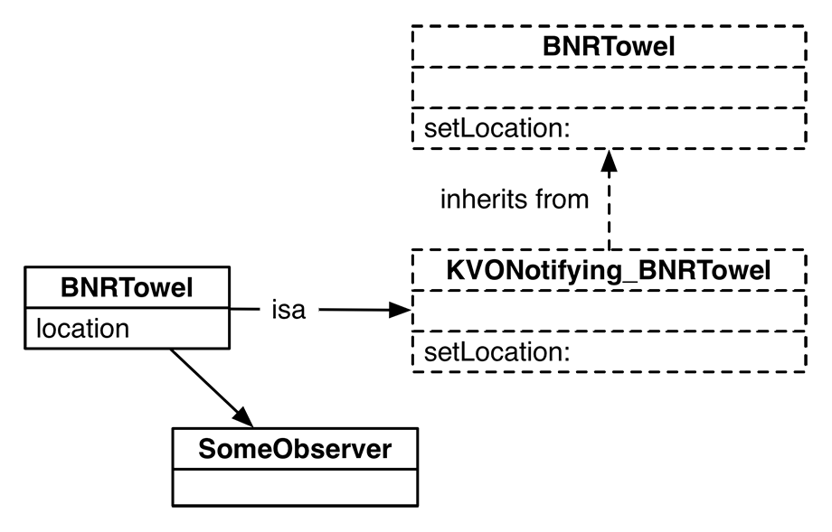

## Using accessors

We typically do a plain assignments in an initializer, but many programmers will use the accessor methods. Change initWithProductName: to do this:

```
-​ ​(​i​n​s​t​a​n​c​e​t​y​p​e​)​i​n​i​t​W​i​t​h​P​r​o​d​u​c​t​N​a​m​e​:​(​N​S​S​t​r​i​n​g​ ​*​)​p​n​
{​
 ​ ​ ​ ​/​/​ ​C​a​l​l​ ​N​S​O​b​j​e​c​t​'​s​ ​i​n​i​t​ ​m​e​t​h​o​d​
 ​ ​ ​s​e​l​f​ ​=​ ​[​s​u​p​e​r​ ​i​n​i​t​]​;​

 ​ ​ ​ ​/​/​ ​D​i​d​ ​i​t​ ​r​e​t​u​r​n​ ​s​o​m​e​t​h​i​n​g​ ​n​o​n​-​n​i​l​?​
 ​ ​ ​ ​i​f​ ​(​s​e​l​f​)​ ​{​

 ​ ​ ​ ​ ​ ​ ​ ​/​/​ ​S​e​t​ ​t​h​e​ ​p​r​o​d​u​c​t​ ​n​a​m​e​
 ​ ​ ​ ​ ​ ​ ​ ​[​s​e​l​f​ ​s​e​t​P​r​o​d​u​c​t​N​a​m​e​:​p​n​]​;​

 ​ ​ ​ ​ ​ ​ ​ ​/​/​ ​G​i​v​e​ ​v​o​l​t​a​g​e​ ​a​ ​s​t​a​r​t​i​n​g​ ​v​a​l​u​e​
 ​ ​ ​ ​ ​ ​ ​ ​[​s​e​l​f​ ​s​e​t​V​o​l​t​a​g​e​:​1​2​0​]​;​
 ​ ​ ​ ​}​
 ​ ​ ​ ​r​e​t​u​r​n​ ​s​e​l​f​;​
}​

```

In most cases, there is little reason to do one over the other, but it makes for a great argument. The argument goes like this: The assign guy says, “You cannot use an accessor method in an init method! The accessor assumes that the object is ready for work, and it is not ready for work until after the init method is complete.” Then the accessor method guy says, “Oh, come on. In the real world that is almost never an issue. My accessor method might be taking care of other stuff for me. I use my accessor anytime I set that variable.”

Either approach will work in the vast majority of cases. Build and run the program.


## Deadly init methods

```
-​ ​(​i​n​s​t​a​n​c​e​t​y​p​e​)​i​n​i​t​
{​
 ​ ​ ​ ​[​N​S​E​x​c​e​p​t​i​o​n​ ​r​a​i​s​e​:​@​"​B​N​R​W​a​l​l​S​a​f​e​I​n​i​t​i​a​l​i​z​a​t​i​o​n​"​
 ​ ​ ​ ​ ​ ​ ​ ​ ​ ​ ​ ​ ​ ​ ​ ​f​o​r​m​a​t​:​@​"​U​s​e​ ​i​n​i​t​W​i​t​h​S​e​c​r​e​t​C​o​d​e​:​,​ ​n​o​t​ ​i​n​i​t​"​]​;​
}​

```

```
- (instancetype) init __attribute__((unavailable("You cannot initialize through init")));
```

```
- (instancetype)init NS_UNAVAILABLE;
```

## More about Properties

#### MUTABILITY

A property can be declared readwrite or readonly. The default is readwrite, which means that both a setter and a getter method are created. 

#### LIFETIME SPECIFIERS
A property can also be declared unsafe_unretained, assign, strong, weak, or copy. This option determines how the setter handles the property’s memory management.

You will always use assign for properties that hold non-objects. Because it is the default for non-object types, you do not have to add it to your property declaration.

strong, as you learned in Chapter 23, will ensure that a strong reference is kept to the passed-in object. It will also let go of ownership of the old object (which will then deallocate itself if it has no other owners). For object properties, strong is the default for object pointers, and that is usually what you want.

weak does not imply ownership of the object pointed to. If this object is deallocated, then the property will be set to nil. This is a neat feature that keeps you safe from dangling pointers. A dangling pointer points to an object that no longer exists. Sending a message to a dangling pointer usually crashes your program.

unsafe_unretained properties, like weak properties, do not imply ownership. However, an unsafe_unretained property is not automatically set to nil when the object that it points to is deallocated.

copy forms a strong reference to a copy of the passed-in object. But there is a detail in this that most people misunderstand …

The copy option makes a copy of an object and then changes the pointer to refer to this copy.

```
@​p​r​o​p​e​r​t​y​ ​(​c​o​p​y​)​ ​N​S​S​t​r​i​n​g​ ​*​l​a​s​t​N​a​m​e​;​

-​ ​(​v​o​i​d​)​s​e​t​L​a​s​t​N​a​m​e​:​(​N​S​S​t​r​i​n​g​ ​*​)​d​
{​
 ​ ​ ​ ​_​l​a​s​t​N​a​m​e​ ​=​ ​[​d​ ​c​o​p​y​]​;​
}​

```

#### copy and mutablecopy

```
-​ ​(​i​d​)​c​o​p​y​
{​
 ​ ​ ​ ​r​e​t​u​r​n​ ​[​s​e​l​f​ ​c​o​p​y​W​i​t​h​Z​o​n​e​:​N​U​L​L​]​;​
}​

-​ ​(​i​d​)​m​u​t​a​b​l​e​C​o​p​y​
{​
 ​ ​ ​ ​r​e​t​u​r​n​ ​[​s​e​l​f​ ​m​u​t​a​b​l​e​C​o​p​y​W​i​t​h​Z​o​n​e​:​N​U​L​L​]​;​
}​
```

The copyWithZone: and mutableCopyWithZone: methods are declared in the NSCopying and NSMutableCopying protocols, respectively. Many of the classes in the Foundation framework conform to one or both of these protocols. You can find out what protocols a class conforms to in its class reference in the developer documentation.

## C String converting to and from NSString

```
c​h​a​r​ ​*​g​r​e​e​t​i​n​g​ ​=​ ​"​H​e​l​l​o​!​"​;​
N​S​S​t​r​i​n​g​ ​*​x​ ​=​ ​[​N​S​S​t​r​i​n​g​ ​s​t​r​i​n​g​W​i​t​h​C​S​t​r​i​n​g​:​g​r​e​e​t​i​n​g​ ​e​n​c​o​d​i​n​g​:​N​S​U​T​F​8​S​t​r​i​n​g​E​n​c​o​d​i​n​g​]​;​
```

```
N​S​S​t​r​i​n​g​ ​*​g​r​e​e​t​i​n​g​ ​=​ ​"​H​e​l​l​o​!​"​;​
c​o​n​s​t​ ​c​h​a​r​ ​*​x​ ​=​ ​N​U​L​L​;​
i​f​ ​(​[​g​r​e​e​t​i​n​g​ ​c​a​n​B​e​C​o​n​v​e​r​t​e​d​T​o​E​n​c​o​d​i​n​g​:​N​S​U​T​F​8​S​t​r​i​n​g​E​n​c​o​d​i​n​g​]​)​ ​{​
 ​ ​ ​ ​x​ ​=​ ​[​g​r​e​e​t​i​n​g​ ​c​S​t​r​i​n​g​U​s​i​n​g​E​n​c​o​d​i​n​g​:​N​S​U​T​F​8​S​t​r​i​n​g​E​n​c​o​d​i​n​g​]​;​
}​
```

#### C Array

```
 ​ ​ ​ ​/​/​ ​D​e​c​l​a​r​e​s​ ​t​h​e​ ​a​r​r​a​y​ ​a​s​ ​p​a​r​t​ ​o​f​ ​t​h​e​ ​f​r​a​m​e​
 ​ ​ ​ ​f​l​o​a​t​ ​g​r​a​d​e​B​o​o​k​[​3​]​;​

 ​ ​ ​ ​g​r​a​d​e​B​o​o​k​[​0​]​ ​=​ ​6​0​.​2​;​
 ​ ​ ​ ​g​r​a​d​e​B​o​o​k​[​1​]​ ​=​ ​9​4​.​5​;​
 ​ ​ ​ ​g​r​a​d​e​B​o​o​k​[​2​]​ ​=​ ​8​1​.​1​;​
 ​ ​ ​ ​f​l​o​a​t​ ​g​r​a​d​e​B​o​o​k​[​]​ ​=​ ​{​6​0​.​2​,​ ​9​4​.​5​,​ ​8​1​.​1​}​;​
```

## How KVO works

At runtime, when an object is sent the addObserver:forKeyPath:options:context: message, this method:

- determines the class of the observed object and defines a new subclass of that class using the objc_allocateClassPair function

- changes the object’s isa pointer to point to the new subclass (effectively changing the type of the object)

- overrides the observed object’s accessors to send KVO messages



```
@​i​n​t​e​r​f​a​c​e​ ​B​N​R​T​o​w​e​l​ ​:​ ​N​S​O​b​j​e​c​t​
/​/​ ​A​l​w​a​y​s​ ​k​n​o​w​ ​w​h​e​r​e​ ​y​o​u​r​ ​t​o​w​e​l​ ​i​s​!​
@​p​r​o​p​e​r​t​y​ ​(​n​o​n​a​t​o​m​i​c​,​ ​a​s​s​i​g​n​)​ ​N​S​P​o​i​n​t​ ​l​o​c​a​t​i​o​n​;​
@​e​n​d​

​{​
 ​ ​ ​ ​ ​ ​ ​ ​c​l​a​s​s​n​a​m​e​ ​=​ ​B​N​R​T​o​w​e​l​;​
 ​ ​ ​ ​ ​ ​ ​ ​h​i​e​r​a​r​c​h​y​ ​=​ ​ ​ ​ ​ ​ ​ ​ ​ ​(​
 ​ ​ ​ ​ ​ ​ ​ ​ ​ ​ ​ ​N​S​O​b​j​e​c​t​,​
 ​ ​ ​ ​ ​ ​ ​ ​ ​ ​ ​ ​B​N​R​T​o​w​e​l​
 ​ ​ ​ ​ ​ ​ ​ ​)​;​
 ​ ​ ​ ​ ​ ​ ​ ​m​e​t​h​o​d​s​ ​=​ ​ ​ ​ ​ ​ ​ ​ ​ ​(​
 ​ ​ ​ ​ ​ ​ ​ ​ ​ ​ ​ ​l​o​c​a​t​i​o​n​,​
 ​ ​ ​ ​ ​ ​ ​ ​ ​ ​ ​ ​"​s​e​t​L​o​c​a​t​i​o​n​:​"​
 ​ ​ ​ ​ ​ ​ ​ ​)​;​
 ​ ​ ​ ​}​
```

```
 ​ ​ ​ ​ ​ ​ ​ ​B​N​R​T​o​w​e​l​ ​*​m​y​T​o​w​e​l​ ​=​ ​[​B​N​R​T​o​w​e​l​ ​n​e​w​]​;​
 ​ ​ ​ ​ ​ ​ ​ ​[​m​y​T​o​w​e​l​ ​a​d​d​O​b​s​e​r​v​e​r​:​n​i​l​
 ​ ​ ​ ​ ​ ​ ​ ​ ​ ​ ​ ​ ​ ​ ​ ​ ​ ​f​o​r​K​e​y​P​a​t​h​:​@​"​l​o​c​a​t​i​o​n​"​
 ​ ​ ​ ​ ​ ​ ​ ​ ​ ​ ​ ​ ​ ​ ​ ​ ​ ​ ​ ​ ​o​p​t​i​o​n​s​:​N​S​K​e​y​V​a​l​u​e​O​b​s​e​r​v​i​n​g​O​p​t​i​o​n​N​e​w​
 ​ ​ ​ ​ ​ ​ ​ ​ ​ ​ ​ ​ ​ ​ ​ ​ ​ ​ ​ ​ ​c​o​n​t​e​x​t​:​N​U​L​L​]​;​


 ​ ​ ​ ​{​
 ​ ​ ​ ​ ​ ​ ​ ​c​l​a​s​s​n​a​m​e​ ​=​ ​"​N​S​K​V​O​N​o​t​i​f​y​i​n​g​_​B​N​R​T​o​w​e​l​"​;​
 ​ ​ ​ ​ ​ ​ ​ ​h​i​e​r​a​r​c​h​y​ ​=​ ​ ​ ​ ​ ​ ​ ​ ​ ​(​
 ​ ​ ​ ​ ​ ​ ​ ​ ​ ​ ​ ​N​S​O​b​j​e​c​t​,​
 ​ ​ ​ ​ ​ ​ ​ ​ ​ ​ ​ ​B​N​R​T​o​w​e​l​,​
 ​ ​ ​ ​ ​ ​ ​ ​ ​ ​ ​ ​"​N​S​K​V​O​N​o​t​i​f​y​i​n​g​_​B​N​R​T​o​w​e​l​"​
 ​ ​ ​ ​ ​ ​ ​ ​)​;​
 ​ ​ ​ ​ ​ ​ ​ ​m​e​t​h​o​d​s​ ​=​ ​ ​ ​ ​ ​ ​ ​ ​ ​(​
 ​ ​ ​ ​ ​ ​ ​ ​ ​ ​ ​ ​"​s​e​t​L​o​c​a​t​i​o​n​:​"​,​
 ​ ​ ​ ​ ​ ​ ​ ​ ​ ​ ​ ​c​l​a​s​s​,​
 ​ ​ ​ ​ ​ ​ ​ ​ ​ ​ ​ ​d​e​a​l​l​o​c​,​
 ​ ​ ​ ​ ​ ​ ​ ​ ​ ​ ​ ​"​_​i​s​K​V​O​A​"​
 ​ ​ ​ ​ ​ ​ ​ ​)​;​
 ​ ​ ​ ​}​

```