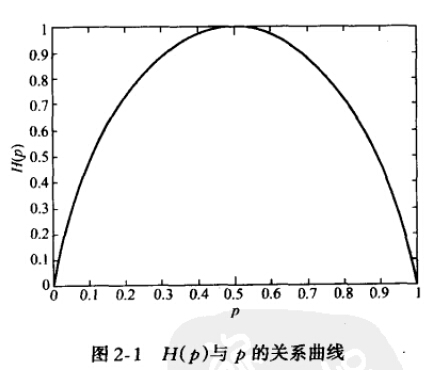
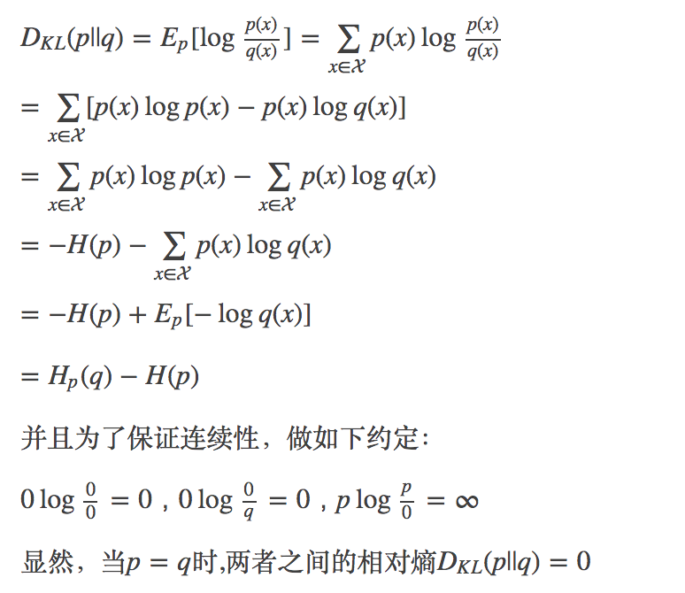
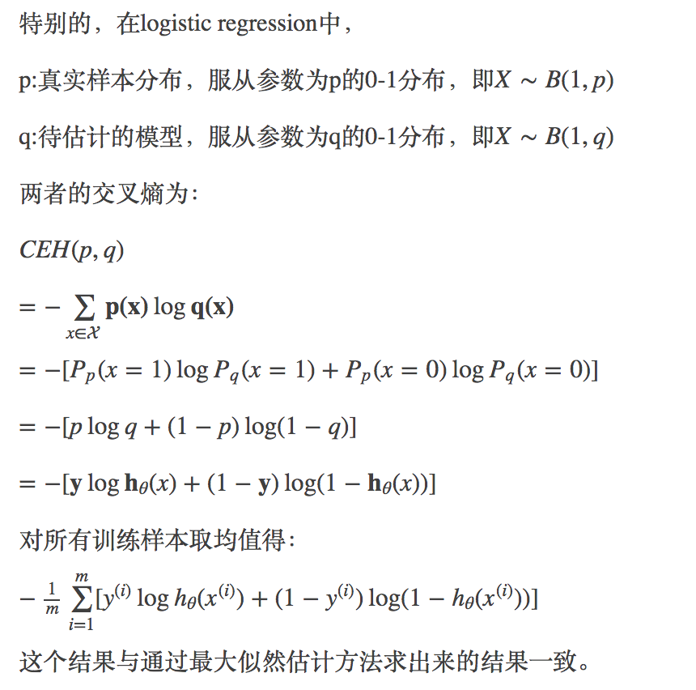

# Learning TensorFlow

Tom Hope 2017

## 一些中文背景阅读资料

#### 交叉熵
[cross-entropy](http://blog.csdn.net/rtygbwwwerr/article/details/50778098)

事件A：小明考试及格，对应的概率P(xA)=0.1，信息量为I(xA)=−log(0.1)=3.3219 
事件B：小王考试及格，对应的概率P(xB)=0.999，信息量为I(xB)=−log(0.999)=0.0014 

HA(x)=−[p(xA)log(p(xA))+(1−p(xA))log(1−p(xA))]=0.4690 
对应小王的熵： 
HB(x)=−[p(xB)log(p(xB))+(1−p(xB))log(1−p(xB))]=0.0114

```
# 小明
2.1.5 :006 > (-Math.log2(0.1)) * 0.1 + 0.9 * (-Math.log2(0.9))
 => 0.4689955935892812 
# 小王
2.1.5 :007 > (-Math.log2(0.001)) * 0.001 + 0.999 * (-Math.log2(0.999))
 => 0.011407757737461138
```

当X为0-1分布时，熵与概率p的关系如下图： 



看出，当p=0或1时，熵为0，即此时X完全确定。 

什么是相对熵？

相对熵(relative entropy)又称为KL散度（Kullback-Leibler divergence），KL距离，是两个随机分布间距离的度量。记为DKL(p||q)。它度量当真实分布为p时，假设分布q的无效性。 



什么是交叉熵？

假设有两个分布p，q，则它们在给定样本集上的交叉熵定义如下： 
CEH(p,q)=Ep[−logq]=−∑x∈p(x)logq(x)=H(p)+DKL(p||q) 



#### TensorFlow中文社区
[TensorFlowCN](http://www.tensorfly.cn/tfdoc/tutorials/mnist_beginners.html)

#### 神经网络和深度学习
[GitBook](https://www.gitbook.com/book/hit-scir/neural-networks-and-deep-learning-zh_cn/details)

[English](http://neuralnetworksanddeeplearning.com/chap3.html#the_cross-entropy_cost_function)

梯度下降算法

我们想象有一个小球从山谷的斜坡滚落下来。我们的日常经验告诉我们这个球终会达到谷底。也许我们可以用这种思想来解决函数最小值的问题？我们随机地为小球选取一个起点，然后开始模拟小球滚落到谷底的运动过程。

随机梯度下降（SGD）的算法

我们能把 SGD 想象成一场民主选举：使用小规模的 mini-batch 计算梯度，比使用整个训练集计算梯度容易得多，就如开展一次民意调查比举行一次完整的选举容易得多。举个例子，在 MNIST 中有个测试数据，我们选取 mini-batch 的大小为，这样，计算梯度的过程就加速了倍！当然，这个估计可能并不准确——仍然会存在统计波动——但也没必要准确：我们只关心在某个方向上移动可以减少，这意味着我们没必要准确去计算梯度的精确值。事实上，SGD 十分有效，广泛应用在神经网络的学习中，它也是本书中展开的大多数学习技术的基础。